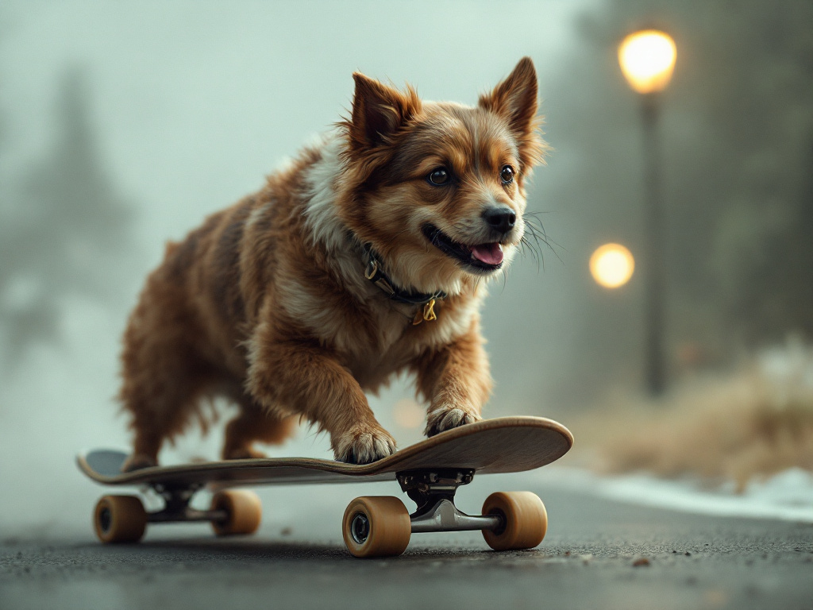
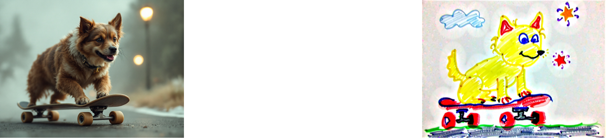

# Griptape Black Forest Extension

## Overview
This extension provides an [Image Generation Driver](https://docs.griptape.ai/stable/griptape-framework/drivers/image-generation-drivers/#amazon-bedrock) for [Black Forest Labs](https://docs.bfl.ml/quick_start/gen_image).

```python
from griptape.black_forest.drivers.black_forest_image_generation_driver import (
    BlackForestImageGenerationDriver,
)
from griptape.structures import Agent
from griptape.tools import FileManagerTool, PromptImageGenerationTool

agent = Agent(
    tools=[
        PromptImageGenerationTool(
            image_generation_driver=BlackForestImageGenerationDriver(
                    model="flux-pro-1.1"
            ),
            off_prompt=True,
        ),
        FileManagerTool(),
    ]
)

agent.run(
    "Save a cinematic, realistic picture of a dog riding a skateboard to the assets directory as dog_skateboard_cinematic.jpeg"
)
```
Output image: 



## Variations

The model offers opportunities to create variations of images using the `PromptImageVariationTool`. You can find examples of agents performing the task in the [examples/drivers](examples/drivers) folder.

### Redux   
  
* [example_agent_variation.py](examples/drivers/example_agent_variation.py)
* model: `flux-pro-1.1-ultra`
* prompt: "dog, skateboard, pencil sketch, black and white"

----

### InPainting


* [example_agent_inpainting.py](examples/drivers/example_agent_inpainting.py)
* model: `flux-pro-1.0`
* prompt: "Replace the dog with a walrus, using the assets/dog_skateboard_mask.jpeg."

----

### OutPainting


* [example_agent_outpainting.py](examples/drivers/example_agent_outpainting.py)
* model: `flux-pro-1.0`
* prompt: "Replace the environment with boat at sea, using the assets/dog_skateboard_env_mask.jpeg."

----

### Depth

* [example_agent_depth.py](examples/drivers/example_agent_depth.py)
* model: `flux-pro-1.0-depth`
* prompt: "Set in a jungle, dog rides on a skateboard, use assets/dog_skateboard_cinematic.jpeg as the control image."

----

### Canny


* [example_agent_canny.py](examples/drivers/example_agent_canny.py)
* model: `flux-pro-1.0-canny`
* prompt: "Childrens messy crayon drawing of a dog on a skateboard, use assets/dog_skateboard_cinematic.jpeg as the control image"

----

## Installation

Poetry:
```bash
poetry add git+https://github.com/griptape-ai/griptape-black-forest.git
```

Pip:
```bash
pip install git+https://github.com/griptape-ai/griptape-black-forest.git
```
